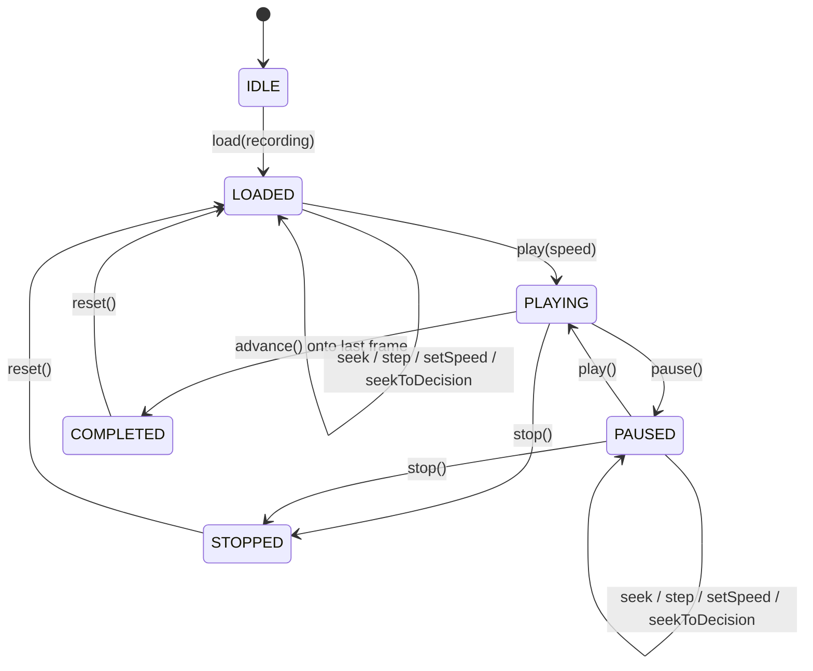
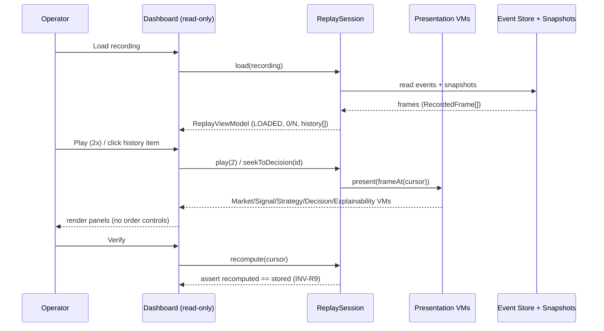

# I3 Architecture — Operator Console (Replay + Presentation + Dashboard)

Read-only. No Execution / Order / Paper Trading. Inherits Constitution + I1/I2
(Thin Core, Deterministic Runtime, Event Sourcing, Decision SSOT).

## 1. Replay Architecture

Replay re-runs the pure Trading Core over stored Snapshots + Events to reproduce
the identical Decision. Determinism is guaranteed by a frozen replay clock, no rng,
and no external I/O. The `@genesis/replay-engine` `OperatorReplaySession` wraps a
recording (an ordered `RecordedFrame[]`) with transport controls.

```
Event Store + Snapshots
  -> Timeline builder (group events by correlation_id) -> RecordedFrame[]
  -> OperatorReplaySession(timeline)
       - restoreSnapshot(cursor) -> MarketSnapshot
       - restoreDecision(cursor) -> Decision (stored, reproject)
       - recompute(cursor)       -> re-run TradingCore (frozen clock) == stored  [INV-R9]
```

Objects: ReplaySession, ReplayTimeline, ReplayCursor, ReplaySpeed (1|2|5|10),
ReplayState, ReplayEvent (session-audit only), Snapshot Restore, Decision Restore.

## 2. Dashboard Architecture

An Operator Console that looks like a live terminal but is an AI Decision Viewer.
Every surface is read-only; the only interactive controls are the Replay transport
(and Decision History navigation). Data binds exclusively to Presentation
ViewModels fed by a ReplaySession.

```
ReplaySession -> Presentation ViewModels -> apps/dashboard panels (read-only)
```

Dependency DAG (one-way): decision-engine -> replay-engine -> presentation -> dashboard.
The dashboard has no path to any Execution Gateway (enforced by A-category invariant
+ dependency-boundary check).

## 3. Replay State Machine



Navigation (seek/step/seekToDecision) is allowed only in LOADED/PAUSED. `advance()`
moving onto the last frame returns false and transitions to COMPLETED.

## 4. Component Tree

```
<App> (dark theme; read-only context)
 └─ <DashboardLayout>
    ├─ <MarketPanel>            <- MarketViewModel
    ├─ <Grid>
    │  ├─ <SignalPanel>         <- SignalViewModel[]
    │  ├─ <StrategyPanel>       <- StrategyViewModel
    │  ├─ <DecisionPanel>       <- DecisionViewModel (RR, indicative size)
    │  ├─ <ExplainabilityPanel> <- ExplainabilityViewModel (trace + contributions)
    │  └─ <InvariantPanel>      <- InvariantViewModel (46/46 GREEN)
    └─ <ReplayPanel>            <- ReplayViewModel
       ├─ <ReplayTransport>     (play/pause/stop | 1x 2x 5x 10x | frame +/- | decision +/-)
       └─ <DecisionHistoryPanel><- ReplayViewModel.history[] (click -> seekToDecision)
```

## 5. Sequence Diagram



## 6. Event Flow

```
[record time — I2] MarketSnapshot -> Signal.created -> Strategy.selected -> Decision.created
                   (appended to Event Store; Snapshots persisted)
[review time — I3] Events + Snapshots -> RecordedFrame[] -> ReplaySession
                   -> Presentation ViewModels -> Dashboard (read-only render)
```

The dashboard produces no trading events; only session-local navigation events
(CursorMoved, SpeedChanged) go to a separate session-audit log.

## 7. State Flow

Three orthogonal scopes:

- Recording state: immutable `RecordedFrame[]` (never mutated by the console).
- Transport state: ReplayState + cursor + speed (mutated only by transport actions).
- View state: pure function of the frame at the cursor — `render = present(frameAt(cursor))`.

```
transport action -> reduce(ReplayState, cursor, speed)
                  -> frame = timeline.at(cursor.frame_index)
                  -> viewmodels = present(frame)
                  -> panels render (pure)
```
